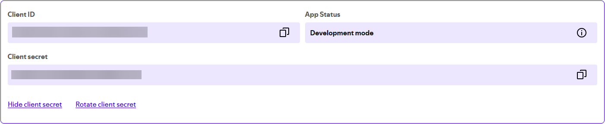
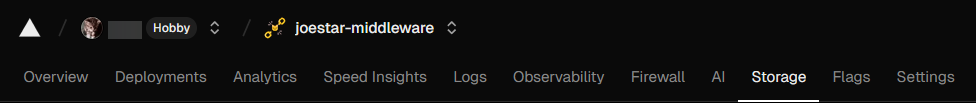
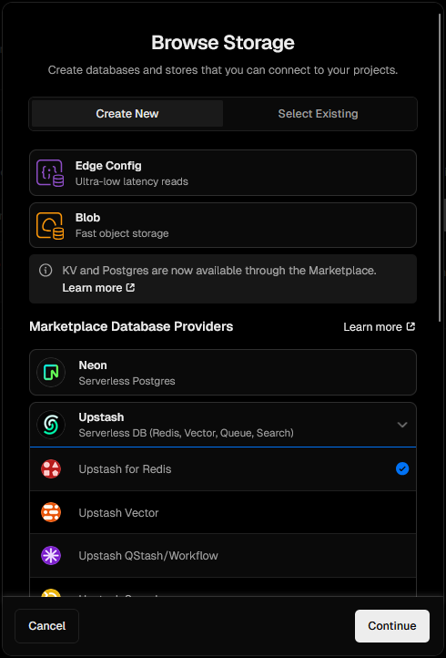
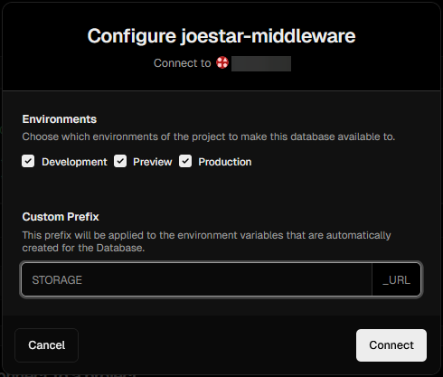
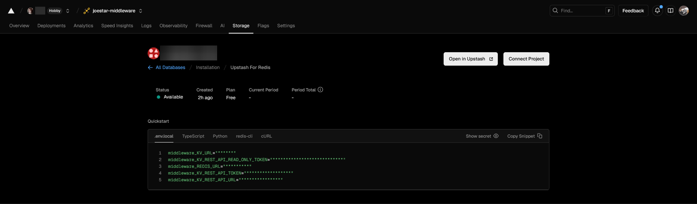

<h1 align="center">🔌 joestar middleware</h1>

<p align="center">
    
</p>

A middleware server for [my portfolio website](https://github.com/joejo-joestar/joestar), providing Spotify currently playing track, GitHub activity, and Unsplash photo collections.
This project provides a simple Express server with three main API endpoints, each handled in separate route files:

---

## Dependencies

| Package                                                     | Description                                                                                                                      |
| ----------------------------------------------------------- | -------------------------------------------------------------------------------------------------------------------------------- |
| [express](https://expressjs.com)                            | A minimal and flexible Node.js web application framework that provides a robust set of features for web and mobile applications. |
| [serve-favicon](https://github.com/expressjs/serve-favicon) | A middleware for serving a favicon.                                                                                              |
| [http-errors](https://github.com/jshttp/http-errors)        | Create HTTP errors for Express, Koa, Connect, etc.                                                                               |
| [axios](https://axios-http.com/docs/intro)                  | Promise based HTTP client for the browser and node.js                                                                            |
| [dotenv](https://github.com/motdotla/dotenv)                | Loads environment variables from a `.env` file into `process.env`                                                                |
| [cors](https://github.com/expressjs/cors)                   | Node.js CORS middleware                                                                                                          |

---

## Project Structure

Below is a compact tree of the most important files and folders with a short note about their purpose.

```plaintext
joestar-middleware/
├── README.md     # Project documentation
├── package.json  # npm scripts, dependencies
├── app.js        # Express entry point
├── public/         # Static assets served as-is
│   ├── 404.html    # Oneko cat animation
│   └── index.html  # Logo image
├── bin/
│   └── www  # Server start script
└── routes/          # Page routes (React Router)
    ├── github.js    # fetch GitHub repositories for the project owner
    ├── index.js     # root route, health check
    ├── spotify.js   # exchange a Spotify refresh token and fetch the "now playing" item
    └── unsplash.js  # fetch Unsplash collections and photos
```

---

## Endpoints

| Endpoint                           | Request Type | Description                                                                                                                                                                               |
| ---------------------------------- | ------------ | ----------------------------------------------------------------------------------------------------------------------------------------------------------------------------------------- |
| `/unsplash/collections`            | `GET`        | Fetches Unsplash collections for the username `UNSPLASH_USERNAME` in the `.env` file (refer to the [example `.env` file](./.env.example)).                                                |
| `/unsplash/collections/:id/photos` | `GET`        | Fetches photos from a specified Unsplash collection (`:id` will be replaced with required `collectionId`).                                                                                |
| `/github/repos`                    | `GET`        | Fetches public repos for the the username `GITHUB_USERNAME` in the `.env` file (refer to the [example `.env` file](./.env.example)), and archived repos, sorted by most recently updated. |
| `/github/:owner/:repo/readme`      | `GET`        | Fetches the `README.md` for specified GitHub Repo from an owner (`:repo` and `:owner` will be replaced with required values (*case insensitive*)).                                        |
| `/spotify/now-playing`             | `GET`        | returns simplified now-playing info.                                                                                                                                                      |

---

## Routes

> [!NOTE]
> All Routes read from environment variables for API keys and tokens. See each section below for details

### Unsplash Route ([`unsplash.ts`](./routes/unsplash.ts))

Fetch collections and photos from the Unsplash API for the gallery pages.

#### Unsplash Envs

- `UNSPLASH_CLIENT_ID`: required for the requests in the current implementation.
- `UNSPLASH_USERNAME`: required for the `user` parameter for the requests

---

### GitHub Route ([`github.ts`](./routes/github.ts))

Fetch repositories for the `joejo-joestar` account (used to populate the Projects list).

#### GitHub Envs

- `GITHUB_ACCESS_TOKEN`: required for requests in current implementation
- `GITHUB_USERNAME`: required for the `user` parameter for the requests

> [!NOTE]
> The helper sends `Authorization: token ${githubToken}` if `GITHUB_ACCESS_TOKEN` is provided.

---

### Spotify Route ([`spotify.ts`](./routes/spotify.ts))

Obtain an access token via a stored refresh token, and fetch the currently-playing item for the authenticated Spotify account.

#### Spotify Envs

- `SPOTIFY_CLIENT_ID`: The `Client ID` from the app created in [Spotify for Developers](https://developer.spotify.com/dashboard/create)
- `SPOTIFY_CLIENT_SECRET`: The `Client Secret` from the app created in [Spotify for Developers](https://developer.spotify.com/dashboard/create)
- `SPOTIFY_REFRESH_TOKEN`: The refresh token gotten after following the steps provided in the [Spotify Setup](#spotify-setup) section

> [!NOTE]
> We use an [Upstash Redis database](https://upstash.com/docs/redis/overall/getstarted) to store (and update) the `SPOTIFY_REFRESH_TOKEN` and a few other variables (more details will be explained in the [Spotify Setup](#spotify-setup) section)
>
> These `middleware_*` Variables are also used in the [`utils/get_refresh_token.js`](./utils/get_refresh_token.js) script

- `middleware_KV_REST_API_URL`: The Upstash Redis Database URL
- `middleware_KV_REST_API_TOKEN`: The Upstash Redis Database API Token

#### Spotify Setup

[This article](https://medium.com/@alagappan.dev/create-a-now-playing-widget-using-the-spotify-web-api-in-react-a6cb564ed923) helped setting up the API calls and tokens for the now playing card. The steps to connect to your spotify account is very convoluted compared to the other endpoints. This is because Spotify is a bitchass crybaby.

- First, head over to [Spotify for Developers](https://developer.spotify.com), create a new app, and fill in the details
- Take Note of the `Client ID` and the `Client Secret`

  

- Next, add the local host IP (`http://127.0.0.1:3001/callback`) (Spotify has blacklisted `http://localhost:5173/` from being used as a redirect URI in the [latest update](https://developer.spotify.com/documentation/web-api/concepts/redirect_uri))

  ```plaintext
  http://127.0.0.1:3001/callback
  ```

  

Now, we setup an Upstash Redis Database to store the Refresh token, the fresh access token and its ttl.

> [!NOTE]
> The following steps assume you are using Vercel to deploy this service

- In your deployed project's page, head over to the stores tab

  

- Then `Create a Database` and select the `Upstash for Redis` option

  

  > [!NOTE]
  > You will be asked to create a free account!

- Follow the steps in the following pages and select the free tier (unless you are willing to pay!) and create a database
- When prompted to enter a custom prefix, put in `middleware` (this repo uses the `middleware` prefix, you can use whatever you want!)

  

- In the console page, you will find the environment variables for the Upstash Redis Database. Save these in your `.env` file for local development and the setup

  

> [!Tip]
> Follow the [Local Development](#local-development) steps before continuing to simplify the whole process!

Once this prereq is complete, simply run the [utility script](./utils/get_refresh_token.js) and follow the steps to generate a spotify refresh token and store it in the Redis Database!

```bash
npm i
node utils/get_refresh_token.js
```

---

## Local Development

1. Clone the repository

```bash
git clone https://github.com/joejo-joestar/joestar-middleware
cd joestar-middleware
```

2. Run to install dependencies

```bash
npm i
```

3. Create a `.env` file in the root directory with the required environment variables (refer to the [example `.env` file](./.env.example))
4. Start the server with

```bash
npm start
```

5. Access the endpoints at `http://localhost:3000/<endpoint>`

> [!TIP]
> You can use an API client to test the endpoints
>
> Try out [Yaak Client](https://github.com/mountain-loop/yaak) or [Hoppscotch Web App](https://hoppscotch.io)

---
