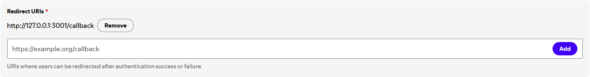

<h1 align="center">🔌 joestar middleware</h1>

<p align="center">
    
</p>

A middleware server for [my portfolio website](https://github.com/joejo-joestar/joestar), providing Spotify currently playing track, GitHub activity, and Unsplash photo collections.

## Dependencies

| Package                                              | Description                                                                                                                      |
| ---------------------------------------------------- | -------------------------------------------------------------------------------------------------------------------------------- |
| [express](https://expressjs.com/)                    | A minimal and flexible Node.js web application framework that provides a robust set of features for web and mobile applications. |
| [http-errors](https://github.com/jshttp/http-errors) | Create HTTP errors for Express, Koa, Connect, etc.                                                                               |
| [axios](https://axios-http.com/docs/intro)           | Promise based HTTP client for the browser and node.js                                                                            |
| [dotenv](https://github.com/motdotla/dotenv)         | Loads environment variables from a `.env` file into `process.env`                                                                |
| [cors](https://github.com/expressjs/cors)            | Node.js CORS middleware                                                                                                          |

# API Shenanigans

This project provides a simple Express server with three main API endpoints, each handled in separate route files:

- `routes/unsplash.js`: fetch Unsplash collections and photos
- `routes/repos.js`: fetch GitHub repositories for the project owner
- `routes/spotify.js`: exchange a Spotify refresh token and fetch the "now playing" item

---

## Conventions

- All routes use `axios` and return parsed JSON / normalized objects.
- Examples use top-level `await` for brevity (assume inside an async context in real code).

---

## Endpoints

| Endpoint                           | Request Type | Description                                                                                                                                    |
| ---------------------------------- | ------------ | ---------------------------------------------------------------------------------------------------------------------------------------------- |
| `/unsplash/collections`            | `GET`        | Fetches Unsplash collections for the [`@joejojoestar`](https://unsplash.com/@joejojoestar) account.                                            |
| `/unsplash/collections/:id/photos` | `GET`        | Fetches photos from a specified Unsplash collection (`:id` will be replaced with required `collectionId`).                                     |
| `/github/repos`                    | `GET`        | Fetches public repos for the [`joejo-joestar`](https://github.com/joejo-joestar) account, and archived repos, sorted by most recently updated. |
| `/spotify/now-playing`             | `GET`        | returns simplified now-playing info.                                                                                                           |

---

## Routes

> [!NOTE]
> All Routes read from environment variables for API keys and tokens. See each section below for details

### Unsplash route ([`unsplash.ts`](./routes/unsplash.ts))

Fetch collections and photos from the Unsplash API for the gallery pages.

#### Unsplash Envs

- `UNSPLASH_CLIENT_ID`: required for the requests in the current implementation.

---

### GitHub route ([`github.ts`](./routes/github.ts))

Fetch repositories for the `joejo-joestar` account (used to populate the Projects list).

#### GitHub Envs

- `GITHUB_ACCESS_TOKEN`: reqiured for requests in current implementation

> [!NOTE]
> The helper sends `Authorization: token ${githubToken}` if `GITHUB_ACCESS_TOKEN` is provided.

---

### Spotify route ([`spotify.ts`](./routes/spotify.ts))

Obtain an access token via a stored refresh token, and fetch the currently-playing item for the authenticated Spotify account.

#### Spotify Envs

- `SPOTIFY_CLIENT_ID`: The `Client ID` from the app created in [Spotify for Developers](https://developer.spotify.com/dashboard/create)
- `SPOTIFY_CLIENT_SECRET`: The `Client Secret` from the app created in [Spotify for Developers](https://developer.spotify.com/dashboard/create)
- `SPOTIFY_REFRESH_TOKEN`: The refresh token gotten after following the steps provided in the [Spotify Setup](#spotify-setup) section

#### Spotify Endpoints

- Token endpoint: `https://accounts.spotify.com/api/token`
- Now playing: `https://api.spotify.com/v1/me/player/currently-playing`

#### Behavior

- `getAccessToken(...)` posts `grant_type=refresh_token` to Spotify's token endpoint using HTTP Basic auth (`clientId:clientSecret` base64 encoded).
- `getNowPlaying()` calls `getAccessToken` with the env vars, then requests the now-playing endpoint with `Authorization: Bearer <access_token>`, normalizes the response, and returns a simplified object on success. If no track is playing or an error occurs it returns an error message string.

#### Spotify Setup

[This article](https://medium.com/@alagappan.dev/create-a-now-playing-widget-using-the-spotify-web-api-in-react-a6cb564ed923) helped setting up the API calls and tokens for the now playing card. The steps to connect to your spotify account is very convoluted compared to the other endpoints.

- First, head over to [Spotify for Developers](https://developer.spotify.com/), create a new app, and fill in the details
- Take Note of the `Client ID` and the `Client Secret`
  
- Next, add the local host IP (`https://127.0.0.1:5173/`) (Spotify has blacklisted `http://localhost:5173/` from being used as a redirect URI in the [latest update](https://developer.spotify.com/documentation/web-api/concepts/redirect_uri))
  

Now, we generate a "Refresh Token", which will be used to generate fresh "Access Tokens" for the actual api call.

- Modify the below url with your `Client ID` from the [Spotify for Developers dashboard](https://developer.spotify.com/dashboard)

  ```plaintext
  https://accounts.spotify.com/en/authorize?client_id=<YOUR_CLIENT_ID>&response_type=code&redirect_uri=http%3A%2F%2F127.0.0.1:5173%2F&scope=user-read-currently-playing
  ```

- Agree to the authorization in this page
  

- Next, take note of the url of the redirected page, it should have a `?code=` parameter, like so,

  ```plaintext
  http://127.0.0.1:5173/?code=<SOME_REALLY_LONG_STRING>
  ```

- Now, generate a `base64` string of the form `<YOUR_CLIENT_ID>:<YOUR_CLIENT_SECRET>` (`e81...a07:0b0...57c`). The base64 scting can be generated [online here](https://www.base64encode.org/)
- Modify this `curl` command by adding the generated base64 string, and the `code` from the url earlier

  ```bash
  curl
  -H "Authorization: Basic <BASE64_CLIENT_ID_AND_SECRET_STRING>"
  -d grant_type=authorization_code
  -d code=<CODE_FROM_URL>
  -d redirect_uri=http://127.0.0.1:5173/ https://accounts.spotify.com/api/token
  ```

  the command should look something like this:

  ```bash
  curl -H "Authorization: Basic ZTg...N2M=" -d grant_type=authorization_code -d code=AQA...Eag -d redirect_uri=http://127.0.0.1:5173/ https://accounts.spotify.com/api/token
  ```

- The `curl` command should return the following response. From this, make note of the `refresh_token`

  ```json
  {
    "access_token": "BQD...fSw",
    "token_type": "Bearer",
    "expires_in": 3600,
    "refresh_token": "AQA...OGw",
    "scope": "user-read-currently-playing"
  }
  ```

- Now, store all the noted values of `Client ID`, `Client Secrt`, and this `refresh_token` in their respective environemt variables (see [Spotify Envs](#spotify-envs))

---

## Local .env example

Create a `.env` file:

```plaintext
UNSPLASH_CLIENT_ID=your_unsplash_client_id
GITHUB_ACCESS_TOKEN=ghp_yourgithubtoken
SPOTIFY_CLIENT_ID=your_spotify_client_id
SPOTIFY_CLIENT_SECRET=your_spotify_client_secret
SPOTIFY_REFRESH_TOKEN=your_saved_refresh_token
```

---
